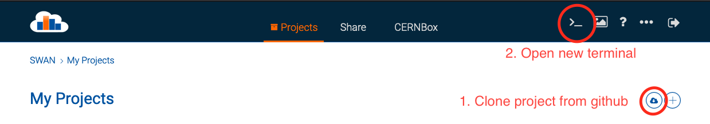
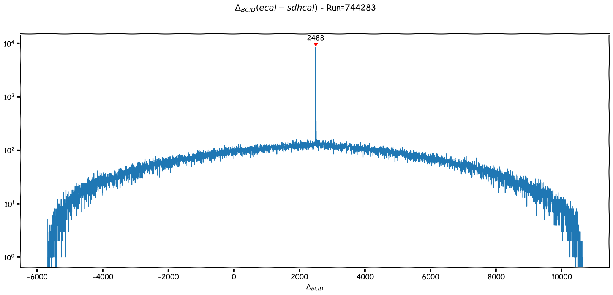
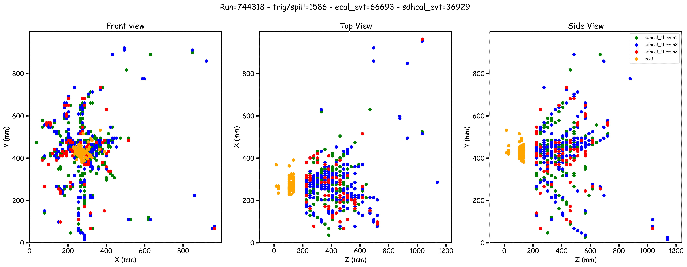
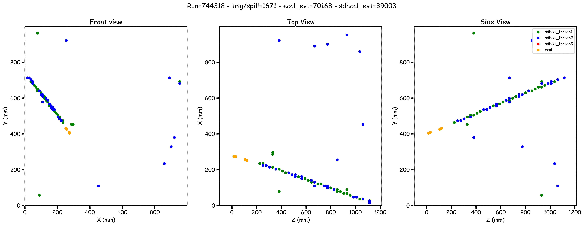
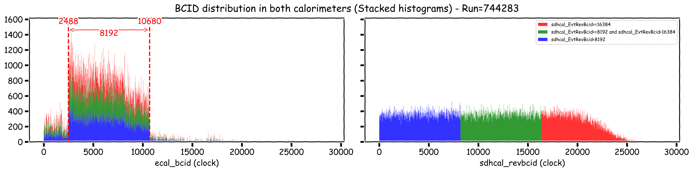
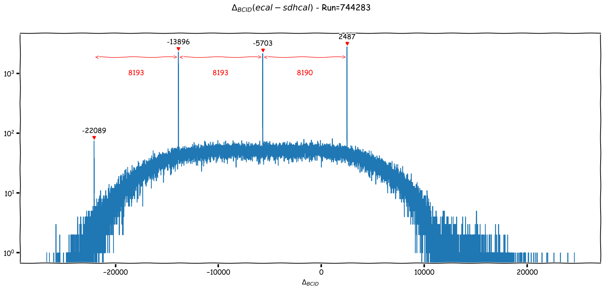
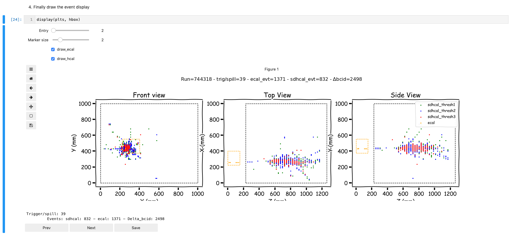

# SiWEcal_SDHCAL_Common_Reconstruction

Set of python executables to reconstruct common SiWEcal-SDHCAL event.

## Disclaimer

I am spending as little time as possible working with ROOT, as such all these scripts rely on standard python package for data science (Numpy, scipy, matplotlib and pandas + jupyterlab for the interactive notebooks) instead of ROOT.

All the input/output files are still root files, you can read them with ROOT without problem if you want to roll your own analysis.

## Installation

All script were made with python3.7 but should be compatible with python2.7.
You'll need the following dependencies:

* pandas
* numpy
* scipy
* matplotlib
* jupyterlab (for the notebook files)
* tqdm (progress bar)
* loguru (logger to print beautiful messages in your terminal)
* uproot (to read root files and transform them to numpy/pandas format)
* root_pandas (to write the results as root files, should no longer be needed once uproot add writing tree to root files)

### Swan

The easiest setup is to use the swan instance from cern:

1. Go to <https://swan.cern.ch/> and login with your cern credentials. Create a new instance and you'll be presented with a screen similar to this: 
2. Click on the download icon on the top right corner and paste the project github url, swan will automatically clone it.
3. Click on `New Terminal` on the top banner
4. `pip install --user uproot tqdm ipympl widgetsnbextension`
5. You're done, you can now go to [Reconstruction procedure](#reconstruction-procedure).

### Locally

#### With pip

This can be done with the following one-liner:

```bash
pip install uproot root_pandas scipy tqdm loguru matplotlib jupyterlab ipympl # maybe with sudo or --user, or in a virtualenv
```

But to avoid any trouble with mismatching package version I suggest using conda instead.

#### With conda (recommended)

The whole process should take about 5min, you'll then have a fully configured environment (including latest version of root with python3 bindings if thats your thing).

1. Install miniconda

```bash
curl https://repo.anaconda.com/miniconda/Miniconda3-latest-Linux-x86_64.sh -o miniconda.sh # Replace Linux by MacOSX if running on mac
bash miniconda.sh -b -p $HOME/miniconda
export PATH="$HOME/miniconda/bin:$PATH"
```

2. Then the dependency

```bash
conda config --add channels conda-forge # if you haven't added conda-forge already
env_name=commonRecEnv # Change to whatever name you want
conda create -y -n ${env_name}
export CONDA_ENV_PATH=$HOME/miniconda/envs/${env_name}
conda activate ${env_name}
conda install -y -c conda-forge root_pandas uproot scipy matplotlib
pip install tqdm loguru
```

Notice you now have `(commonRecName)` on the left of your prompt, this means you properly activated the environment and you're set to go.  
If you want to quit the environment type `conda deactivate`.  
To reactivate it type `conda activate commonRecEnv` (or whatever name you chose).  
If unsure of the name you gave you can find it back with: `conda info --envs`

If you plan on using the notebook files (`.ipynb` extension) you'll also need the following:

``` bash
conda install -y nodejs
conda install -y -c conda-forge jupyterlab ipympl widgetsnbextension
jupyter labextension install @jupyter-widgets/jupyterlab-manager
jupyter labextension install jupyter-matplotlib
```

Start jupyterlab from the project folder with `jupyter lab` (make sure you activated your conda environment before). A new tab will open in your preferred web browser, open one of the notebook. Eventually edit the variables in the first cell then execute each cells with `shift-enter`.

## Reconstruction procedure

Note: SDHCAL people use `trigger` while ecal people use `spill` to describe a full acquisition. Whenever these terms are mentioned assume they are interchangeable.

Steps to find common event:

1. Merge data from both calorimeters (Done with [make_common_event_tree](#merging-the-trees)):
   * Open time reconstructed data from both calorimeters (accessible to member of the common testbeam e-group)
     * ecal : `/eos/project/s/siw-ecal/TB2018-09/Common/ECAL/{Particle}_{Energy}GeV/{run_number}__build.root`
     * sdhcal : `/eos/user/a/apingaul/CALICE/Data/SPS_09_2018/Trivent/DHCAL_Trivent_Ecal_{run_number}.root`
   * Iterate through each set of data 1 trigger/spill at a time
     * For each sdhcal event associate all ecal events from this trigger (or vice versa)
     * Compute the time difference between each pair of event in 5MHz clock ($\Delta_{bcid} = ecal_{bcid} - sdhcal_{EvtRevBcid}$)

2. Plot the $\Delta_{bcid}$ distribution and find the most probable value that we define as `bcid_shift` (Done interactively with `draw_bcid_distributions.ipynb`)


3. Find the list of pair of events with $\Delta_{bcid} = bcid\_shift \pm 10$.
     * The value 10 is chosen due to:
       * Ecal events are reconstructed within $\pm4 clocks$  
       * Sdhcal events are reconstructed within $\pm2 clocks$
       * Shift in the $\Delta_{bcid}$ due to binning/low statistics/peak estimators
4. Apply geometrical adjustement on hit position, see the SiWEcal [twiki](!https://twiki.cern.ch/twiki/bin/view/CALICE/SiWEcalBT201809Analysis) for more details.
5. Event display example after following the previous steps:



## Ecal bcid correction

As of September 2019 the ecal event bcid need to be corrected for any trigger/spill longer than 8192clocks. Ecal bcid is reset to 2488 each 8192 clocks:


Without correction plotting $\Delta_{bcid}$ results in:


Go to [Correcting ecal bcid](#correcting-ecal-bcid) for details.

## Executable info

For any executable in case of doubt how to use it type `python -m script --help`.

### Merging the trees

use `make_common_event_tree.py` with the following options:

* Required options:
  * `--run_list` (`-r`): List of run_number to merge, space separated
  * `--hcal_file_format` (`-f`): Path to hcal file with `run number` replaced by `{run_number}`
  * `--ecal_file_format` (`-e`): Path to ecal file with `run number` replaced by `{run_number}`
  * `--output_file_format`(`-o`): Path to output file with `run number` replaced by `{run_number}`
* Optional:
  * `--ecal_tree_name`: Name of the tree to retrieve in the ecal file, default to `ecal`
  * `--hcal_tree_name`: Name of the tree to retrieve in the hcal file, default to `sdhcal`
  * `--output_tree_name`: Name of the tree to save in the output file, default to `common`
  * `--triggers` (`-n`): Amount of trigger/spill to analyse. If set the output file with be appended with `{n}triggers`
  * `--select_muons`: Apply a simple cut to select mostly muons in the sdhcal, default to `False`
  * `--ecal_slab_cut`: Cut on the min numbers of ecal slab with a hit, default to `3`
  * `--use_xroot`: Wheter to look for the files locally or over the network to a xroot enabled folder, default to `False`. You need a valid kerberos ticket and read access to the remote folder. You will face the following error otherwise: `OSError: [ERROR] Server responded with an error: [3010] Unable to give access - user access restricted - unauthorized identity used Permission denied`
  * `--xroot_url`: Base url to use if using xroot, default to `root://eosuser.cern.ch/` (cern eos space)

Full example:

```bash
python -m make_common_event_tree --run_list 744318 744323 \
                                 --hcal_file_format /eos/user/a/apingaul/CALICE/Data/SPS_09_2018/Trivent/DHCAL_Trivent_Ecal_{run_number}.root \
                                 --ecal_file_format /eos/project/s/siw-ecal/TB2018-09/Common/ECAL/PiPlus_70GeV/{run_number}__build.root \
                                 --output_file_format /eos/user/a/apingaul/CALICE/Data/SPS_09_2018/Trivent/Common_{run_number}.root \
                                 --ecal_tree_name ecal \
                                 --hcal_tree_name sdhcal \
                                 --output_tree_name common \
                                 --use_xroot \
                                 --ecal_slab_cut 4
```

Unpacking the individual hits is useless and (ungodly) long for this step. To speed up the process (by a factor of 10+) only the following branches are processed and written to the common tree:

* ecal: `spill`, `event`, `bcid`, `nhit_slab`
* hcal: `TrigNum`, `EvtNum`, `EvtRevBcid`, `NHits`
  
The name of the tree is prepended to each branch in the common tree (e.g. `spill` becomes `ecal_spill`)

### Correcting ecal bcid

Run `correct_ecal_bcid.py` with the following options:

* Required options:
  * `--run_list` (`-r`): List of run_number to merge, space separated
  * `--common_file_format` (`-f`): Path to common file with `run number` replaced by `{run_number}` (file produced by `make_common_event_tree.py`)
  * `--output_file_format`(`-o`): Path to output file with `run number` replaced by `{run_number}`
* Optional:
  * `--clock_cut`: Correction to apply to ecal bcid, in 5MHz clock. Every time the sdhcal_bcid goes over a multiple of this value, will add this value to the ecal bcid, default to `8192`
  * `--triggers` (`-n`): Amount of trigger/spill to analyse. If set the output file with be appended with `{n}triggers`
  * `--common_tree_name`: Name of the tree to retrieve in the common file, default to `common`
  * `--output_tree_name`: Name of the tree to save in the output file, default to `common`
  * `--use_xroot`: Wheter to look for the files locally or over the network to a xroot enabled folder, default to `False`. You need a valid kerberos ticket and read access to the remote folder. You will face the following error otherwise: `OSError: [ERROR] Server responded with an error: [3010] Unable to give access - user access restricted - unauthorized identity used Permission denied`
  * `--xroot_url`: Base url to use if using xroot, default to `root://eosuser.cern.ch/` (cern eos space)

Full example:

``` bash
python -m correct_ecal_bcid --run_list 744283 744318 \
                            --common_file_format /eos/user/a/apingaul/CALICE/Data/SPS_09_2018/Trivent/Common_{run_number}.root \
                            --output_file_format /eos/user/a/apingaul/CALICE/Data/SPS_09_2018/Trivent/Common_{run_number}_bcid_corrected.root \
                            --clock_cut 8192 \
                            --use_xroot
```

Since its only correcting data from the merged trees, the same subset of branches are available in the output file.

### Event display

This is done interactively with the `event_display.ipynb` notebook:

1. If using swan, open `event_display.ipynb`
   1. Else activate your conda environment: `conda activate commonRecEnv` (see [setup](#with-conda-highly-recommended)) and run `jupyter lab`
   2. Your browser should open a new tab to <http://localhost:8888/lab>
   3. Open the `event_display.ipynb` file from the left panel.
2. Edit variables in the cell at step 1.
3. Run each cell by hitting `shift-enter` for each one of them. Or select `Run`->`Run All Cells` from the menu.

You should be presented with the following:


* Click on `next`/`previous` or use the slider to display different events.
* Use the marker size and show ecal show hcal buttons to adjust the drawing to your liking.
* Click on save to save the currently displayed event to the `Figs/` folder. Naming scheme is `Event_display_{run_number}_trig{spill}_ecal{event}_sdhcal{EvtNum}.png`.
